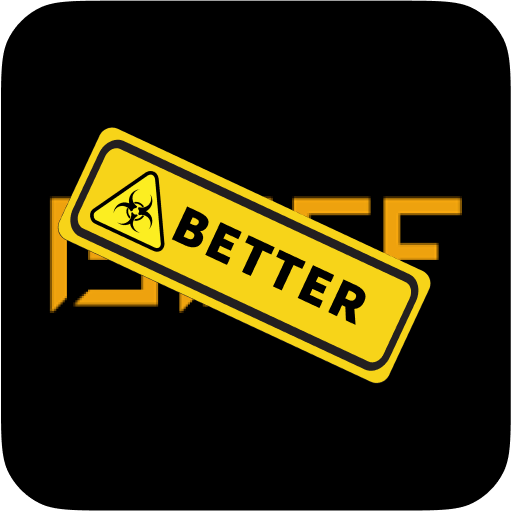

<p align="center"></p>
<h1 align="center">BetterBuff <font color="gray">- BETA</font></h1>


[](https://raw.githubusercontent.com/GODrums/betterbuff/LICENSE)

Based on the original [BuffUtility](https://github.com/PenguiniVogel/BuffUtility) by Penguini, this extension aims to improve the user experience on the chinese site [Buff163](https://buff.163.com/).

<p align="center">
  <a href="https://chromewebstore.google.com/detail/betterfloat/bphfhlfhnohppnleaehnlfigkkccpglk">
    <picture>
      <source srcset="https://i.imgur.com/XBIE9pk.png" media="(prefers-color-scheme: dark)">
      </picture></a>
  <a href="https://addons.mozilla.org/en-US/firefox/addon/betterfloat/">
    <picture>
      <source srcset="https://i.imgur.com/ZluoP7T.png" media="(prefers-color-scheme: dark)">
      </picture></a>
  </br></br>
</p>

## 🤝 Community / Support

<p>
We share the same discord server with my other extension <a href="https://github.com/GODrums/BetterFloat">BetterFloat</a>. Feel free to join us if you have any questions or suggestions:
</p>
<p align="center">
  <a href="https://discord.gg/VQWXp33nSW">
    <picture>
      <source srcset="https://i.postimg.cc/Fzj7T05w/discord.png" media="(prefers-color-scheme: dark)">
      </picture></a>
</p>

## ⌨️ Development

### 💻 The Tech Stack

<p>
  
  
  
  
  
  
  
</p>

### 🛠️ Build Instructions

#### 1. Install dependencies

```bash
  pnpm install
  # Setup your local WXT environment
  pnpm postinstall
```

#### 2. Run the extension

-   Run a development command

```bash
  # For chrome
  pnpm dev
  # For firefox
  pnpm dev:firefox
  # Watch mode (Chrome) for HRM
  pnpm watch
```

#### 4. Build the extension

-   Run the build command

```bash
  # Build for chrome
  pnpm build
  # Build for firefox
  pnpm build:firefox
```

-   This will update the `dist` folder in the root directory with the necessary changes
-   It it always recommended to run the `clean` command before building the extension
-   When publishing the extension, a zipped version is required. `scripts/publish.ts` can be used to create a zip file of the `dist` folder

### 5. Miscellaneous

```bash
  # Update all dependencies
  pnpm update
  # Clean the /dist folder
  pnpm clean
  # Check for Svelte errors
  pnpm check
  # Zip the extension for release
  pnpm zip
  pnpm zip:firefox
```

### Contributing

To contribute to this project, create your own fork of the repository and submit a pull request.
Please follow the [conventional commits](https://www.conventionalcommits.org/en/v1.0.0/) specification (or an equivalent one) and make sure to format your code with [Prettier](https://prettier.io/).

## ⚠️ Disclaimer

BetterBuff is developed independently, and is not officially endorsed by or affiliated with Buff163 (NetEase) in any way. If you are a legal representative of the aforementioned company and would like this project to be taken down, please contact me directly at legal@rums.dev.

Built with 🖤 in Munich.
